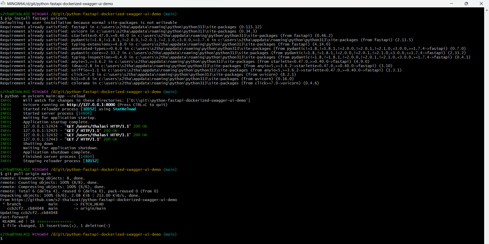
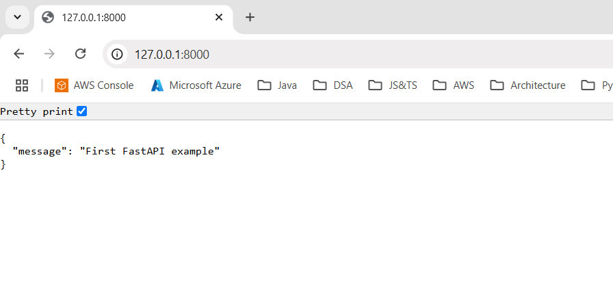
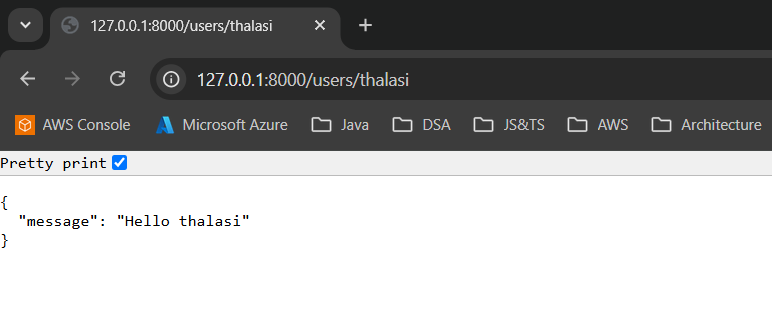

# python-fastapi-dockerized-swagger-ui-demo

Python FastAPI Dockerized with Swagger UI Demo

## FastAPI

FastAPI is a modern, high-performance web framework for building APIs with Python, 
and it includes built-in support for Swagger and OpenAPI.

Swagger is a set of open-source tools built around the OpenAPI specification that 
allows you to design, build, document, and consume RESTful web services. 

FastAPI automatically generates interactive API documentation using Swagger UI, 
which allows developers to easily explore and test their APIs.

### Key Features:

    Automatic Documentation: FastAPI automatically generates OpenAPI documentation, 
    which is used by Swagger UI.

    Interactive UI: Swagger UI provides an interactive interface to explore and test APIs.

    Easy Integration: Integrating Swagger with FastAPI is straightforward, requiring minimal code.

    Customization: Swagger UI can be customized to match branding and specific needs.

    Validation: FastAPI uses Python type hints to validate and serialize request and response data. 

### Install FastAPI and Uvicorn.

Uvicorn is an ASGI web server implementation for Python.

Until recently Python has lacked a minimal low-level server/application interface for async frameworks. 
The ASGI specification fills this gap, and means we're now able to start building a common set 
of tooling usable across all async frameworks.

Uvicorn currently supports HTTP/1.1 and WebSockets.

    pip install fastapi uvicorn

### Create a FastAPI application.

    @app.get("/", summary="First FastAPI example")
    async def my_first_get_api():
    return {"message":"First FastAPI example"}

### Run the application using Uvicorn.

    python -m uvicorn main:app --reload

### URL: 

    http://127.0.0.1:8000/
    

    http://127.0.0.1:8000/users/thalasi
    

